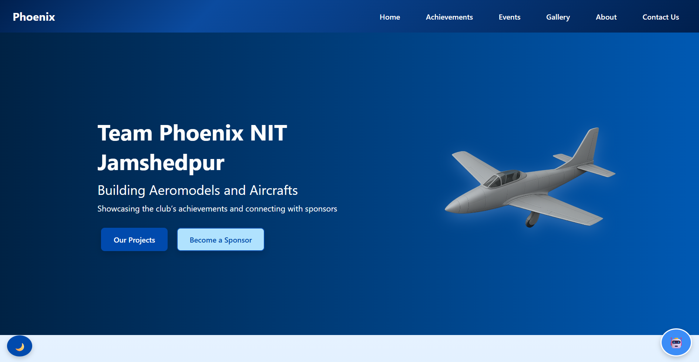

# 🚀 Team Phoenix – Official Website

Welcome to the official website of **Team Phoenix**, the Aero-Designing and Aeromodelling team of **NIT Jamshedpur**. This website showcases our passion for UAV design, innovation, and engineering excellence.

🔗 **Live Website**: [https://ayushv-nitj.github.io/team-phoenix-website/](https://ayushv-nitj.github.io/team-phoenix-website/)

Watch a tour video on yt
 (https://youtu.be/wQiapfEz2lc?si=nXTA3TIfRPyn_EkE)
---

## 📌 Features

- 🛩️ **About Us** – Learn more about our mission, domains, and milestones.
- 🏆 **Achievements** – Explore our national and international accomplishments.
- 📸 **Gallery** – Browse through images and videos of our projects and events.
- 📂 **Downloads** – Access brochures, presentations, and documents.
- 📅 **Events** – Stay updated with our recent and upcoming technical events.
- 💬 **Chatbot** – Interact with a mini AI chatbot powered by ChatGPT.
- 🌗 **Dark Mode** – Toggle between light and dark themes.
- 📜 **Smooth UI** – With animations, scroll effects, hover modals, and a responsive layout.
- 🧭 **Navigation** – Hamburger menu for mobile view with dropdown sections.

---

## 🧠 Tech Stack

- **HTML5 / CSS3 / JavaScript**
- **Node.js & Express (for Chatbot API)**
- **OpenAI / OpenRouter API** for ChatGPT integration
- **AOS.js**, **Embla Carousel**, and **Font Awesome** for frontend interaction

---

📄 License
This project is licensed under the MIT License – feel free to use, modify, and contribute!

🙌 Support & Contribution
Contributions, suggestions, and collaborations are welcome! If you’d like to support Team Phoenix through sponsorships or collaboration, please reach out via our Contact Page or email us directly.

“We innovate. We fly. We lead.” – Team Phoenix ✈️